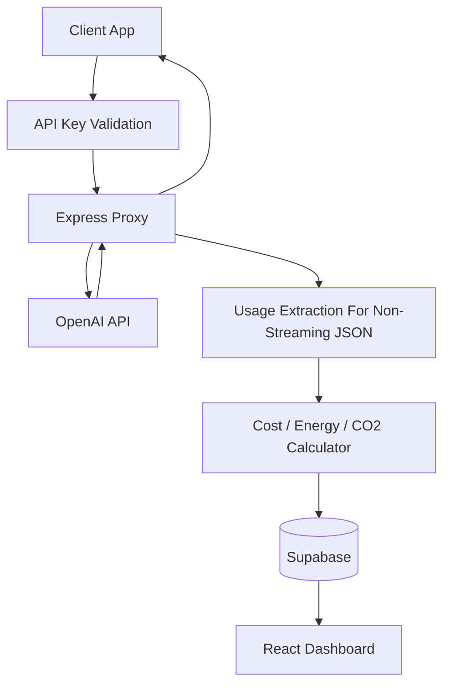

# V1 Architecture

## System View



## Request Flow

```mermaid
sequenceDiagram
    participant Client
    participant Proxy
    participant OpenAI
    participant Logger
    participant DB as Supabase

    Client->>Proxy: Request + x-api-key
    Proxy->>OpenAI: Forward upstream request
    OpenAI-->>Proxy: Response bytes
    Proxy-->>Client: Stream upstream bytes unchanged
    alt Non-streaming JSON response within collection cap
        Proxy->>Logger: Async log payload after client response ends
        Logger->>DB: Insert usage log + estimates
    else Streaming/SSE response
        Proxy-->>Client: Pass-through only; no V1 usage log
    end
```

## V1 Boundaries

- OpenAI is the only provider in scope.
- Logging is async and must not block the client response path.
- Non-streaming JSON responses are tee-collected up to a bounded cap for usage extraction after the client response ends.
- Streaming/SSE responses are pass-through only and are not written to `usage_logs` in V1.
- `usage_logs.cost_usd` preserves 12 decimal places with `numeric(18, 12)`.
- Energy and CO2 are estimates, not scientific claims.
- Dashboard scope is one page: summary cards plus recent logs.

## Component Responsibilities

- `apps/backend`: proxy, auth, provider adapter, calculation, REST endpoints
- `apps/dashboard`: read-only V1 UI
- `packages/shared`: shared types, constants, and DTOs
- `supabase/migrations`: schema and later seed or policy changes
