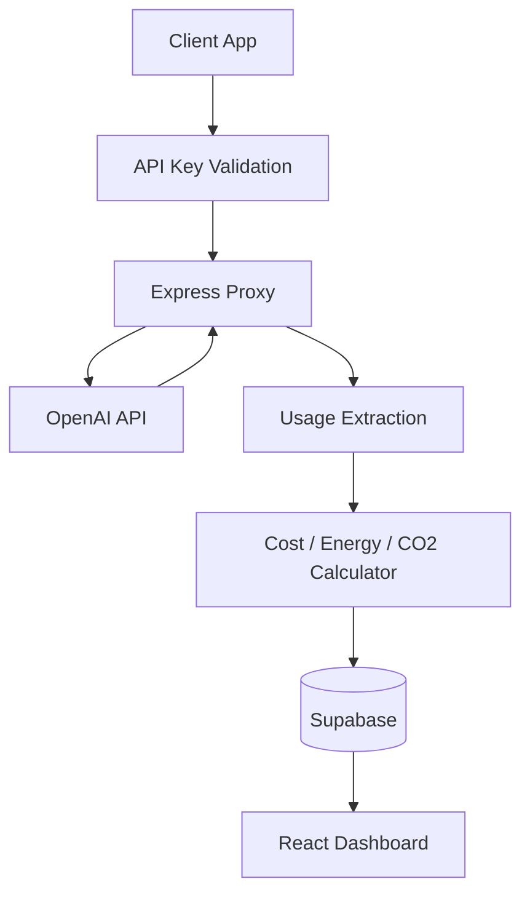
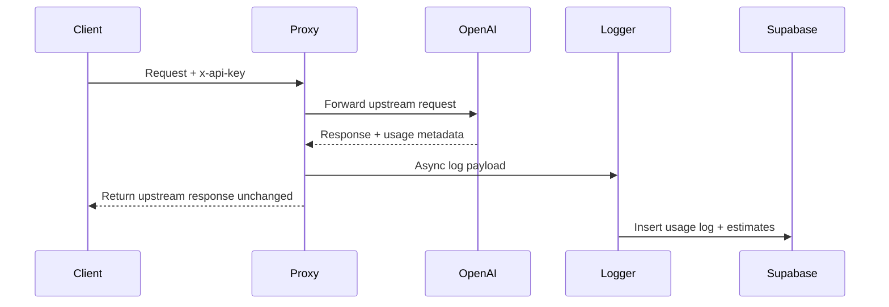

# V1 Architecture

## System View

## Request Flow

## V1 Boundaries

- OpenAI is the only provider in scope.
- Logging is async and must not block the client response path.
- Energy and CO2 are estimates, not scientific claims.
- Dashboard scope is one page: summary cards plus recent logs.

## Component Responsibilities

- `apps/backend`: proxy, auth, provider adapter, calculation, REST endpoints
- `apps/dashboard`: read-only V1 UI
- `packages/shared`: shared types, constants, and DTOs
- `supabase/migrations`: schema and later seed or policy changes
